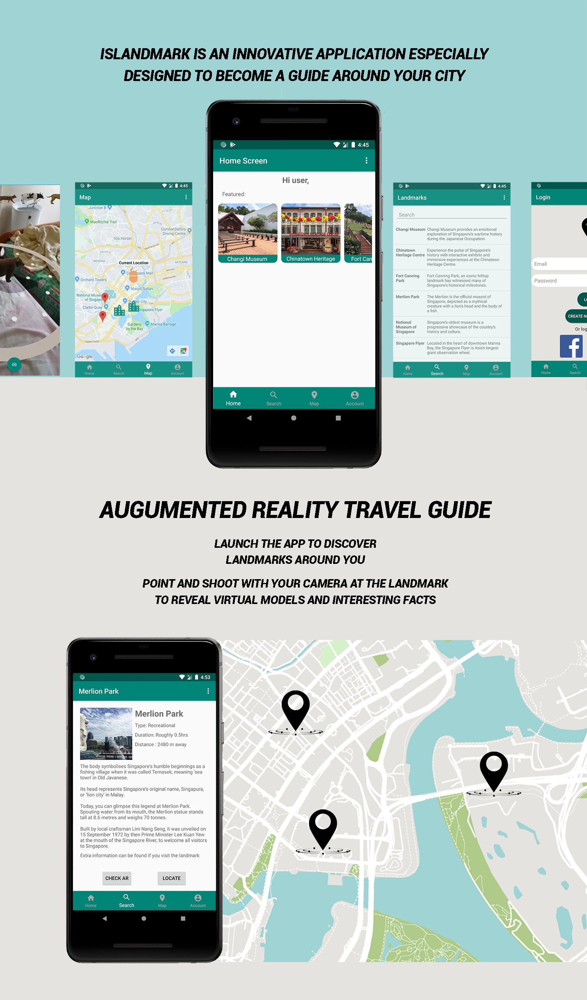

# IslandMark

IslandMark is an Augument Reality travel application to enhance certain landmarks located in Singapore and create compelling connected AR experiences for cultural tourists. 

It is created with Android Studio, Firebase and ARCore

## Features:
A few things you can do with IslandMark:

- Locate iconic landmarks in the vicinity of its user. 
- Plant AR models around the landmark
- Overlay lengthy word descriptions with augumented videos.
- Search for a list of the landmarks sorted by its type
- Keep track of landmarks visited.
- Language feature(Only Chinese and English available now)

## How to contribute:
Want to contribute? Great!

To fix a bug or enhance an existing module, follow these steps:

- Fork the repo
- Create a new branch (git checkout -b improve-feature)
- Make the appropriate changes in the files
- Add changes to reflect the changes made
- Commit your changes (git commit -am 'Improve feature')
- Push to the branch (git push origin improve-feature)
- Create a Pull Request

## Authors and acknowledgement
- hooncp
- naixe

## License 
MIT
